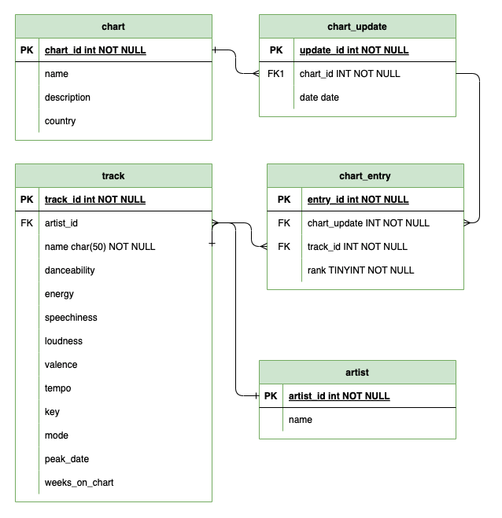

# 🎵 Popatoms
looking for the future by looking at the past

### 👥 The Team
Gabriela: https://www.linkedin.com/in/gabriela-casero-59233a131/
Almudena: https://www.linkedin.com/in/almudenamcastro/

### Business Opportunity: 
Every year the music market changes and new trends appear that change how we listen to music. 
This project aims to analyze the major musical hits of the past 50 years to understand the influence of various factors on the popularity of songs, as well as their evolution. Using data extracted from the Spotify API and the Billboard API, we explore features such as energy, tempo, duration, and other attributes to understand their relationship with chart success.

### 💡 Project goals: 
- Draft Entity Relation Diagram (ERD).
- Create SQL data schema.
- Seeding. 
- SQL queries. 
- Import data to python for further analysis and data visualisation. 

Presentation with more info: https://www.canva.com/design/DAGQjz4IelY/GuO8nIyDawsMBsXLvI5mQA/view?utm_content=DAGQjz4IelY&utm_campaign=designshare&utm_medium=link&utm_source=editor

## Project content
### 📁 Files Structure
The project is organized into the following key files and folders:

- `0_ERD_diagram`: Entity relation driagram (drawio file).  
- `1_schema_creation`: Create the data schema in SQL
- `2_seeding`: Send data from Python into the database.
- `3_queries`: SQL queries for analysis.
- `main.py`: The main project file that gets data from the queries and visualise them. 
- `requirements.txt`: A list of dependencies required to run the project.
- `README.md`: This file describes the purpose of the project and how to run it.
- `sql...csv`: data files. 

### 📊 Data Sources

- **Spotify API**: From this API, we obtained data related to song features, such as tempo, energy, duration, mode, and others.
- **Billboard API**: From this API, we extracted the historical rankings of the most popular songs, enabling a temporal analysis.
  
The analysis focused on understanding how these attributes and features change over time and their impact on popularity.

### 🛠️ Tools Used

- **Language**: Python
- **APIs**: Spotify, Billboard
- **Libraries**:
  - `requests`: For interacting with APIs
  - `pandas`: For data manipulation
  - `matplotlib` / `seaborn`: For data visualization
  - `dotenv`: To manage API credentials
  - `jupyter`: For exploratory analysis
  - `SQL`: For data storage and exploration. 

## 📈 Results and Conclusions

- Music popularity increased dramatically after 1960. 
- Music accousticness has decreased over the years. 
- Music loudness has increased significantly. 

## 📝 Contributions

If you want to contribute to this project, feel free to send a pull request or report issues. All feedback and suggestions are welcome.

## Other sources: 
- https://www.latimes.com/entertainment/tv/showtracker/la-et-st-beatles-ed-sullivan-50-years-20140202-story.html

